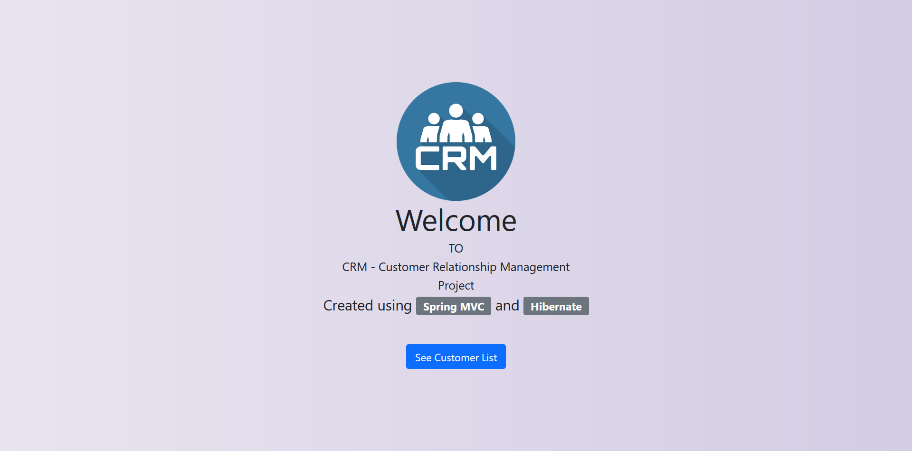
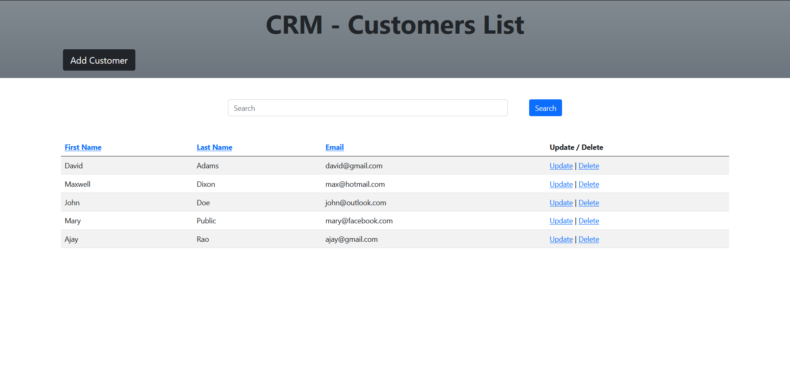
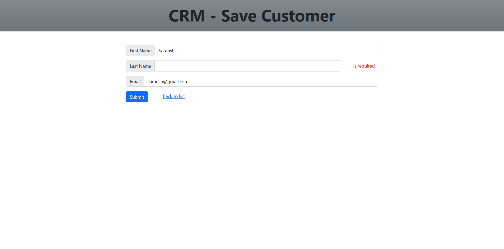
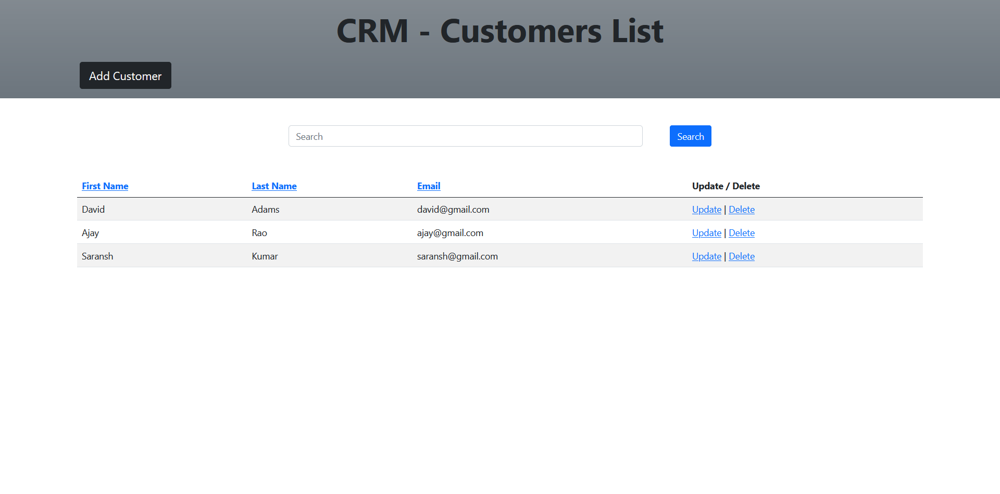
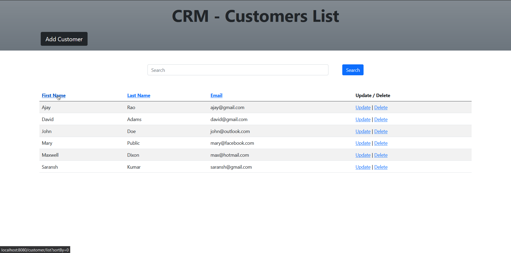
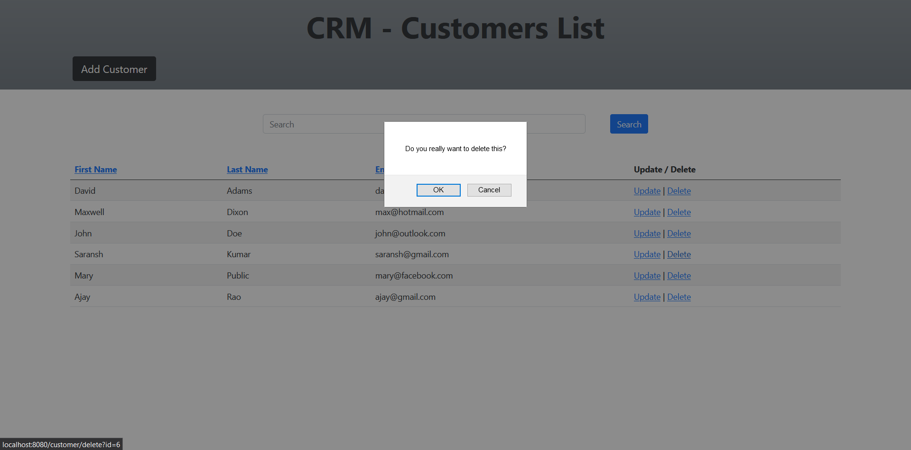

# CRM - Customer Relationship Management System

This is simple Spring application for CRM created using Spring MVC and Hibernate.

### Functionality
- CRUD operations for Customer Management.
- Search based on first name, last name and email.
- Sort the data based on first name, last name and email.
- Used Service facade and DAO design principles.
- Added bean validation on Customer properties.
- Added Spring AOP for logging (@Before and @AfterReturning advice).
---

## Screenshots

#### Home/index page

#### Customer List

#### Add Customer and Bean Validation with custom message

#### Update Customer

#### Search Functionality

#### Sort Functionality

#### Delete Customer
