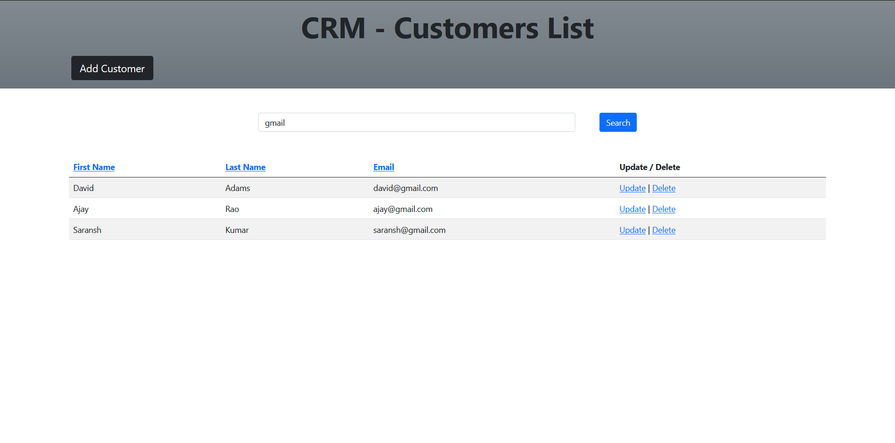

# CRM - Customer Relationship Management System

This is simple Spring application for CRM created using Spring MVC and Hibernate.

### Functionality
- CRUD operations for Customer Management.
- Search based on first name, last name and email.
- Sort the data based on first name, last name and email.
- Used Service facade and DAO design principles.
- Add bean validation on Customer properties.
---

## Screenshots

 
 
 
 
 
 

